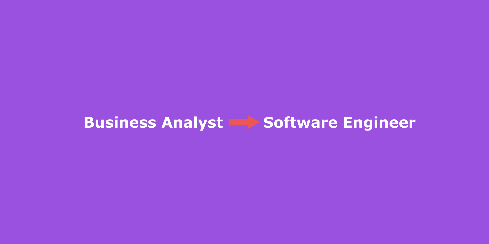

### A little bit of background

The first job I landed was a Business Analyst role. 

As a bridge between business people and developers, I found it most of the cases I couldn’t understand the pain point of developers. That triggers me to think of moving to be a software engineer. Yea, that sounds naive, I know.

Very luckily, I found a programmer job in a software house without a lot of programming experience (with some sort of prototypes showcasing my knowledge). The first 2 months were very tough, everything was new to me, Agile methodology, programming frameworks, etc. It has been difficult but fruitful that I think I can never grow any faster. And indeed, after about 3 years now, I feel like I am stuck and without full confidence in saying I am well qualified. Hmm, yes, maybe this is Impostor Syndrome.

Photo by [Aleksandra Boguslawska](https://unsplash.com/@aleksandraboguslawska?utm_source=unsplash&utm_medium=referral&utm_content=creditCopyText) on [Unsplash](https://unsplash.com/@aleksandraboguslawska?utm_source=unsplash&utm_medium=referral&utm_content=creditCopyText)

### These are some thoughts of mine. Have you gone through the same?

- Want to contribute to an open-source project but afraid your code is not good enough.
- Finding articles on Medium.com related to your professional but you have never heard of it and you fear you are not ready?
- A feeling of left behind. Have to chase new technologies and topics all the time.
- Not confident enough to share your view with others.
- Wonder why those excellent developers can maintain their jobs so well and still contribute to the community and make a lot of great things?
- Question yourself whether you are qualified to ask for a salary raise or promotion.

### Things we can do
There are articles listing how to overcome the Impostor Syndrome. This article is not going to do the same, because I simply don’t have the answer, I haven’t overcome it yet.

Photo by [Christopher Gower](https://unsplash.com/@cgower/?utm_source=Kwinten_Blog&utm_medium=referral) on [Unsplash](https://unsplash.com/?utm_source=Kwinten_Blog&utm_medium=referral)

Wait. What? Are you going to end this article with nothing?

Nuh, I am going to share what I am trying to do though.

I think teaching is an important part of learning, platforms like Medium.com are good, you can learn, write, and get started quickly. The good thing about it is when you share or teach something, you have to look up lots of resources, do some experiments and make sure what you are trying to teach is correct. And, you will get feedback in return, perhaps good or bad, compliment or criticize. Don’t let the negative things stop you from even trying to share.

> It may hurt a bit, but I believe it gets better in the long run.

What I would suggest is to try to start with something small and easy to achieve. That’s probably would build you some confidence. Maybe a topic like below.

- Thoughts on managing your work-life balance as a developer
- What you encountered when you try out a framework
- The articles you find interesting and why they are so good

> Remember you need not be an expert to share your thoughts.

Good luck!

### Tools to get started writing
[http://www.hemingwayapp.com/]
(http://www.hemingwayapp.com/)

[https://embed.ly/providers](https://embed.ly/providers)

----------

*This article [originally posted](https://blog.imkwinten.com/article/Why-I-decide-to-move-from-Business-Analyst-to-Software-Engineer?utm_source=medium&utm_medium=referral) on [my personal blog](https://blog.imkwinten.com/?utm_source=medium&utm_medium=referral) where I shared different topics including Node.js, Cloud computing, and other interesting stuff.*
