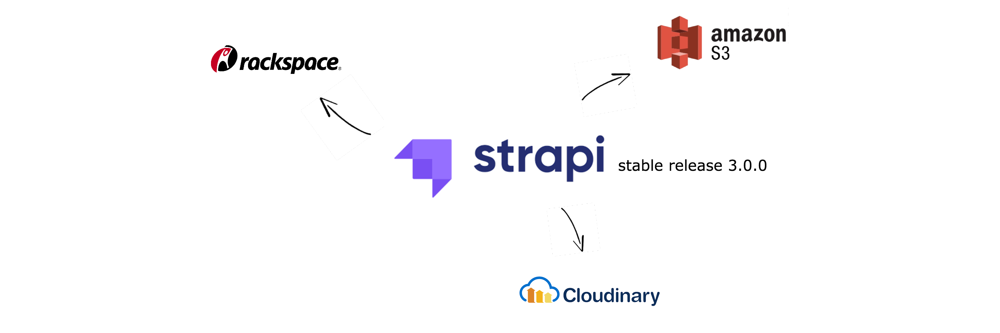

### For Strapi version 3.0.0-beta.20 onward
----------

All you need to do is to create a file at `extensions/upload/config/settings.json`

#### Cloudinary

1. Install [strapi-provider-upload-cloudinary](https://www.npmjs.com/package/strapi-provider-upload-cloudinary)

```bash
yarn add strapi-provider-upload-cloudinary
```

2. Update `extensions/upload/config/settings.json`
```json
{  
  "provider": "cloudinary",  
  "providerOptions": {
    "cloud_name": "YOUR CLOUDINARY CLOUD NAME",
    "api_key": "YOUR CLOUDINARY API KEY",
    "api_secret": "YOUR CLOUDINARY API SECRET"  
  }
}
```

#### AWS S3
1. Install [strapi-provider-upload-aws-s3](https://www.npmjs.com/package/strapi-provider-upload-aws-s3)

```bash
yarn add strapi-provider-upload-aws-s3
```

2. Update `extensions/upload/config/settings.json`

```json
{  
  "provider": "aws-s3",  
  "providerOptions": {
    "accessKeyId": "YOUR AWS IAM ACCESS KEY",
    "secretAccessKey": "YOUR AWS IAM SECRET KEY",
    "region": "YOUR S3 BUCKET REGION",
    "params": {
        "Bucket": "YOUR S3 BUCKET NAME"
    }
  }
}
```

#### Google Cloud Storage (GCS)

1. Install [strapi-provider-upload-google-cloud-storage](https://www.npmjs.com/package/strapi-provider-upload-google-cloud-storage)

```bash
yarn add strapi-provider-upload-google-cloud-storage
```
2. Update `extensions/upload/config/settings.json`

```json
{  
  "provider": "google-cloud-storage",  
  "providerOptions": {
    "serviceAccount": "YOUR GCS SERVICE ACCOUNT JSON",
    "bucketName": "YOUR GCS BUCKET NAME",
    "baseUrl": "https://storage.googleapis.com/YOUR GCS BUCKET NAME"  
  }
}
```

And that’s it! Enjoy!


Photo by [Drew Coffman](https://unsplash.com/@drewcoffman/?utm_source=Kwinten_Blog&utm_medium=referral) on [Unsplash](https://unsplash.com/?utm_source=Kwinten_Blog&utm_medium=referral)

----------

*This article [originally posted](https://blog.imkwinten.com/article/Strapi-stable-version-3.0.x-set-default-file-upload-provider-to-AWS-S3-Google-Cloud-Storage-(GCS)-Cloudinary?utm_source=medium&utm_medium=referral) on [my personal blog](https://blog.imkwinten.com/?utm_source=medium&utm_medium=referral) where I shared different topics on Node.js, Cloud computing, and other interesting stuff.*
