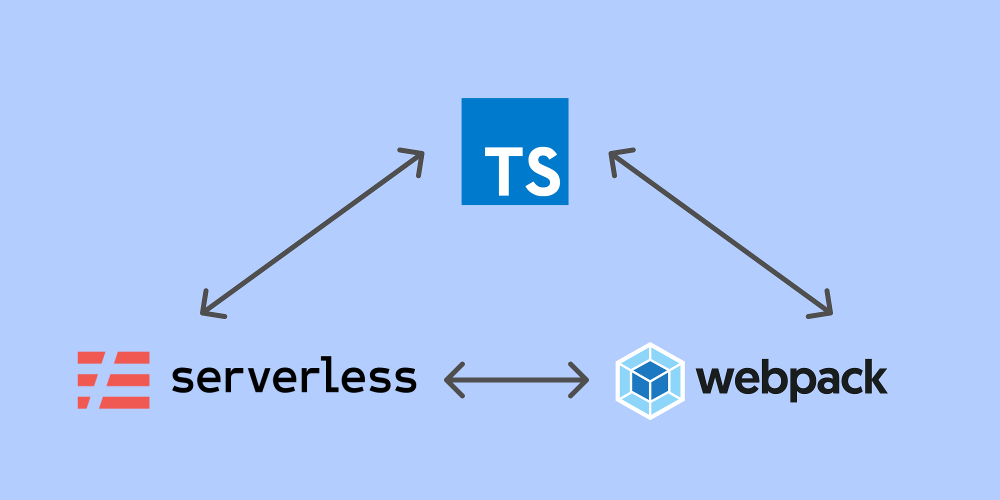

When dealing with the development on AWS, we rely heavily on the serverless framework mainly because of its capability to simulate the Lambda environment and debug locally.

Instead of using ES6 JavaScript, we decided to use TypeScript to surface some errors at build time.

There is a plugin called [serverless-plugin-typescript](https://www.serverless.com/plugins/serverless-plugin-typescript/) that can integrate TypeScript with your serverless application. However, we choose to use webpack to preprocess our application in order to get more controls on the compilation processes.

This article is going to share the basic setup of how we did that.

If you want to check out the result, you can have a look on this [repository](https://github.com/kwinyyyc/serverless-typescript-webpack-build-size).

## Let's get started!

 Photo by [Natalya Zaritskaya](https://unsplash.com/@goodmood77/?utm_source=Kwinten_Blog&utm_medium=referral) on [Unsplash](https://unsplash.com/?utm_source=Kwinten_Blog&utm_medium=referral)

### Approach 1: Deploying the node_modules and bundled js functions to AWS Lambda

With this approach, the js bundle size would be smaller while the overall package size would be larger comparing to approach 2.

Webpack would bundle only the dependencies between files (with the loaders configured) excluding all dependencies in node_modules.

#### Bundled files


#### Steps

1. Create your service with the serverless template `aws-nodejs-typescript`

```bash
serverless create --template aws-nodejs-typescript --path myTypeScriptService
```

2. Update serverless.yml

```yml
service:
  name: aws-nodejs-typescript-service

plugins:
  - serverless-webpack

##### Add below code snippet #####

custom:
  webpack:
    includeModules: true # this is telling webpack to reference all dependencies (non-dev dependencies) in node_modules and serverless would upload the package.json with the node_modules folder
    forceExclude:
      - aws-sdk # this is available in the lambda environment so it can be excluded, this tells serverless-webpack not to include it in the node_modules folder

##################################

provider:
  name: aws
  runtime: nodejs12.x

functions:
  hello:
    handler: handler.hello
    events:
      - http:
          method: get
          path: hello
```

3. Install webpack-node-externals

```bash
yarn add --dev webpack-node-externals
```

4. Update webpack config

```js
const nodeExternals = require("webpack-node-externals");
module.exports = {
  ...
  externals: [nodeExternals()], // this tells webpack not to bundle anything from node_modules folder
  ...
}
```

### Approach 2: Have webpack to bundle everything and tree-shake whatever not needed

With this approach, the js bundle size would be larger while the overall package size would be smaller comparing to approach 1.

Webpack will perform tree-shaking and all required dependencies are bundled in the js file so the node_modules folder would not be included in the package.

#### Bundled files


#### Steps

1. Update serverless.yml

```yml
service:
  name: aws-nodejs-typescript-service

plugins:
  - serverless-webpack

##### Add below code snippet #####

custom:
  webpack:
    includeModules: false # this is the default value, that means serverless webpack would not create the node_modules folder

##################################

provider:
  name: aws
  runtime: nodejs12.x

functions:
  hello:
    handler: handler.hello
    events:
      - http:
          method: get
          path: hello
```

2. Update webpack config

```js
module.exports = {
  ...
  externals: ['aws-sdk'], // this tells webpack not to bundle 'aws-sdk', we don't need this because AWS lambda environment has this included
  ...
}
```

### Approach 3: Have webpack to bundle partially and upload the remaining dependencies to node_modules folder

This is a combination of approach 1 and approach 2. You have to specify the dependencies you do not want Webpack to bundle for you in the `external` property.

Then, leave those dependencies for `serverless-webpack` to create a `package.json` and the `node_modules` to upload on your lambda environment.

With this approach, you can do further optimization using [AWS Lambda Layers](https://docs.aws.amazon.com/lambda/latest/dg/configuration-layers.html) which will store the dependencies that you reuse across different lambdas, you won't have to redeploy these dependencies unless you update their versions.

#### Bundled files


#### Steps

1. Update serverless.yml

```yml
service:
  name: aws-nodejs-typescript-service

plugins:
  - serverless-webpack

##### Add below code snippet #####

custom:
  webpack:
    includeModules: true
    forceExclude:
      - aws-sdk

##################################

provider:
  name: aws
  runtime: nodejs12.x

functions:
  hello:
    handler: handler.hello
    events:
      - http:
          method: get
          path: hello
```

2. Update webpack config

```js
module.exports = {
  ...
  externals: ['moment', 'lodash', 'aws-sdk'], // exclude the dependencies that you want serverless-webpack to upload in the nodule_modules folder
  ...
}
```

---

**That's it for the sharing!
**

Here is an article that explains in detail with examples on these approaches, suggest checking it out.
https://nordcloud.com/minimizing-aws-lambda-deployment-package-size-in-typescript/

 Photo by [Kinga Cichewicz](https://unsplash.com/@all_who_wander/?utm_source=Kwinten_Blog&utm_medium=referral) on [Unsplash](https://unsplash.com/?utm_source=Kwinten_Blog&utm_medium=referral)

---

_This article [originally posted](https://blog.imkwinten.com/article/Using-Serverless-framework-and-Webpack-to-build-AWS-Lambda-in-TypeScript?utm_source=medium&utm_medium=referral) on [my personal blog](https://blog.imkwinten.com/?utm_source=medium&utm_medium=referral) where I shared different topics including Node.js, Cloud computing, and other interesting stuff._
