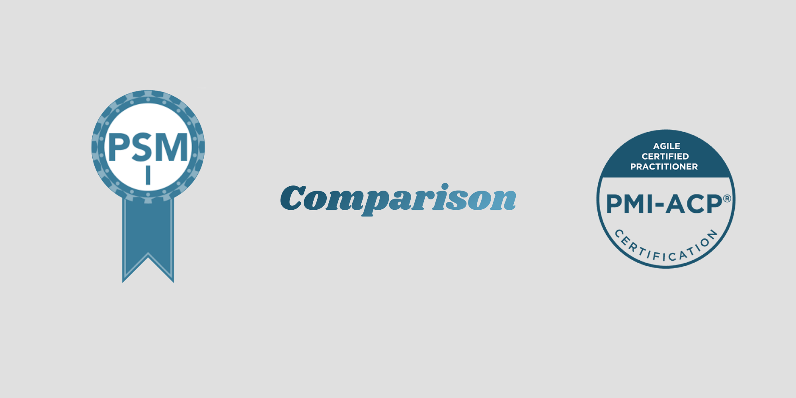

## Background
I am a software developer who has been working on Agile software development. There are a lot of scenarios that bring me to the questions - `Am I doing the right thing? Is it what we supposed to do according to the agile principles?` 

Thus, I decided to learn more about Agile and took [PMI-ACP](https://www.pmi.org/certifications/types/agile-acp) in Jan 2018 and [PSM I](https://www.scrum.org/professional-scrum-master-i-certification) in Jan 2019.
Almost 2 years since I acquired these certifications, I would like to share my thoughts on them like how they are helping my daily works related to Agile projects. To get started, below is a table of comparison between the 2 certifications.

----------

|                      | PMI-ACP                                                                     | PSM I                               |
| -------------------- | --------------------------------------------------------------------------- | ----------------------------------- |
| Expiry               | Renewal needed (30 PDUs every 3 years)                                      | Lifetime                            |
| Cost                 | Member: USD 435, Non-member: USD 495                                        | USD 150                             |
| Issuing Organization | [PMI](https://www.pmi.org/)                                                 | [Scrum.org](https://www.scrum.org/) |
| Format               | Multiple choice                                                             | Multiple choice                     |
| No of questions      | 120  (20 of them are pretest questions and would not counted in your score) | 80                                  |
| Passing score        | 85%                                                                         | 85%                                 |
| Time limit           | 3 hours                                                                     | 1 hour                              |
| Exam prerequisites   | Yes (#1)                                                                    | No                                  |
| Difficulty           | ★★★★                                                                        | ★★                                  |
| Recognition          | ★★                                                                          | ★★★★                                |

*Information as of 26th Jul 2020 
*

\#1: PMI-ACP exam prerequisites ([source](https://www.pmi.org/certifications/types/agile-acp))
- Secondary degree
- 21 contact hours of training in agile practices
- 12 months of general project experience within the last 5 years. A current PMP® or PgMP® will satisfy this requirement but is not required to apply for the PMI-ACP and
- 8 months of agile project experience within the last 3 years

----------

### PMI-ACP

> Overall, it focuses a lot on `why and how`.

PMI-ACP helps a lot on my task when being the Scrum Master, it reminds you to focus on value creation according to Agile Principles and Values. 

The knowledge of the 7 domains is particularly useful.
-  It reminds you to engage your stakeholders, e.g with building personas.
- It teaches you to ensure the user stories in the product backlog stick to the INVEST principle.
- It tells you how to boost team performance with adaptive leadership.
- It describes when, why, and how to conduct a backlog grooming session.
- It is framework-agnostic and advocates `agile` itself 
- etc

In Hong Kong, I found it most of the employers or recruitment agencies have not heard of PMI-ACP. If you are looking for career advancement or salary raise, this is probably a crucial factor that you want to consider.

### PSM I 
> Overall, it focuses a lot on `what`.

I took the PSM I mainly because PMI-ACP in Hong Kong is not very well recognized while comparing with PSM I.

PSM I is pretty straight forward and easy to start with. It teaches you all the things you have to do while working with Scrum which is, to me, a bare minimal agile framework.

You will have an idea about: 
- what ceremonies to conduct
- who is part of the scrum team
- what are the scrum artifacts 
- what would happen in the different timeframe of the sprint and who would be involved in it.
- etc

After a period of time, you may find it does not explain a lot of situations. And in my experience, people would become just following the processes of Scrum without actually realizing the benefits of using it. In contrast, PMI-ACP has significant coverage in this area.

### Final Verdict
I would suggest you go for PSM I if you just start with Agile or if you are a developer that wants to get some basic understanding of Scrum.  On the other hand, if you are experienced in Agile and would like to go further on learning about the know-how, I would suggest you go for PMI-ACP.

#### Good luck on the examination!
 

Photo by [Amy Reed](https://unsplash.com/@amybethreed/?utm_source=Kwinten_Blog&utm_medium=referral) on [Unsplash](https://unsplash.com/?utm_source=Kwinten_Blog&utm_medium=referral)

----------

*This article [originally posted](https://blog.imkwinten.com/article/Agile-certifications-comparison-PSM-I-versus-PMI-ACP?utm_source=medium&utm_medium=referral) on [my personal blog](https://blog.imkwinten.com/?utm_source=medium&utm_medium=referral) where I shared different topics including Node.js, Cloud computing, and other interesting stuff.*
