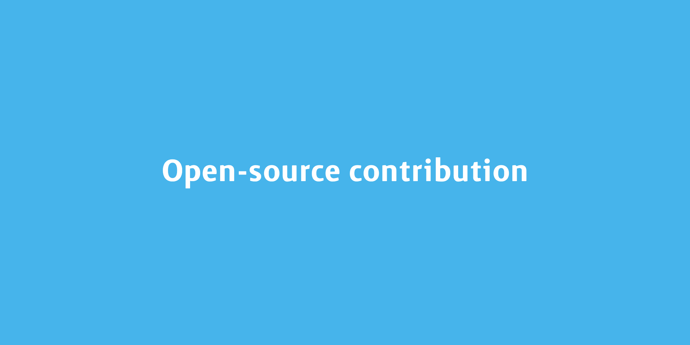

### Looking for an opensource project to contribute to can be a painful process, here is my story searching for it.

There are several criteria that I deem important when searching for an open-source project

1. Tech stack

I would say I will be more comfortable with if the open-source project itself fits the tech stack that I am working on daily. I can learn a lot throughout my contribution while it can be beneficial to my career as well. **Win-win**!

2. The continuity of the project

There are tons of projects on Github and there are more coming every day. It is important for me that the project itself has been running for a while and is likely to continue, in order to avoid moving from projects to projects. Focusing on a particular project would help getting started with open-source contribution. 

3. The community

Whether the core development team and the community welcome new PRs is another crucial factor. It would be great if people are supportive and have first PR friendly issues to get me going.

4. The value of my contribution

I think this is the most important one, after all contributing to the open-source community is trying to create value. If the project is in need and I can offer help on it, it would be a perfect match!

Recently, I have been exploring **Strapi**, they basically fit all the criteria for me. It could be very subjective but I have been enjoying contributing to the Strapi community as well as developing an application with Strapi.

And after a while (**Not long actually!**), the Strapi team gets in touch with me and we talked a few things, which was very joyful. Again, thanks [Strapi team sharing my story](https://strapi.io/blog/kwinten-open-source-community) on their platform, it is a cool project to check out if you haven't done so!

Photo by [Andriyko Podilnyk](https://unsplash.com/@yirage?utm_source=unsplash&utm_medium=referral&utm_content=creditCopyText) on [Unsplash](https://unsplash.com/s/photos/get-started?utm_source=unsplash&utm_medium=referral&utm_content=creditCopyText)

----------

*This article [originally posted](https://blog.imkwinten.com/article/My-way-finding-wonderful-open-source-project-and-start-contributing?utm_source=medium&utm_medium=referral) on [my personal blog](https://blog.imkwinten.com/?utm_source=medium&utm_medium=referral) where I shared different topics including Node.js, Cloud computing, and other interesting stuff.*
