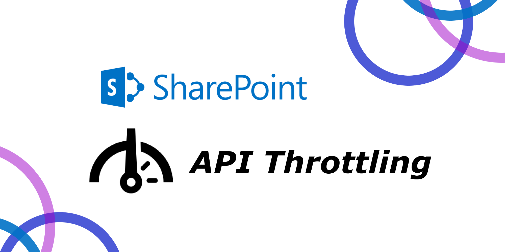

## Different ways dealing with Sharepoint listing API throttling

Sharepoint online listing API will throttle your request and throw a 429 error when your request is querying:

a) more than 5,000 records for non-indexed columns

or b) more than 20,000 records for indexed columns

Sharepoint does not officially announce the figures above but it is the case as of the date of this writing.

>  Noticed it is not the returning result size, it is the list size that you are going to query.

##### Error is thrown like below
`The attempted operation is prohibited because it exceeds the list view threshold enforced by the administrator.` 

Microsoft claims that this threshold is not adjustable due to the fact that SharePoint is a shared environment and this action is to ensure the stability of the environment.

There are several ways we can "avoid" the issue and we are going to discuss them now! Let's get started!

 Photo by [Armand Khoury](https://unsplash.com/@armand_khoury/?utm_source=Kwinten_Blog&utm_medium=referral) on [Unsplash](https://unsplash.com/?utm_source=Kwinten_Blog&utm_medium=referral)

### Method 1. Use pagination (given no needed for filtering and ordering)

If you just need to query a list that has more than 5,000 records but no need to filter or sort the results, then you can simply use pagination via Sharepoint OData Restful API or PnP.js like below.

```javascript
let items = await sp.web.lists.getByTitle("BigList").items.select("Title", "Description").top(50).getPaged<{Title: string}[]>();
```

Beware that you have to use the `getNext` method returned from the result to get the next page result but not using `.skip(100).top(50)` which will return you the wrong result.

```javascript
await items.getNext();
```

### Method 2. Index the columns

If you can ensure your first filter criteria can filter out a significant amount of data. Then you can try indexing your columns.

You can check the official document here on [how to create index](https://support.microsoft.com/en-us/office/add-an-index-to-a-sharepoint-column-f3f00554-b7dc-44d1-a2ed-d477eac463b0).

After you have created indexes for all the columns that you are going to filter. 

In the query, make sure you put the most significant filter like id filter as the first filter parameter so it will reduce the number of records that are going to process.

```javascript
const allItems: any[] = await sp.web.lists.getByTitle("BigList").items.select("Title").filter("Id eq 1 or Title eq 'Test'").getAll();

```

### Method 3. Use the RenderListDataAsStream API

With this approach, you ***won't be able to do sorting*** but you can apply filtering, pagination on a large list without being throttled.

You can achieve this by calling Sharepoint RESTful API or by using CAML query via PnP.js

Below show you an example in PnP.js

```javascript
await sp.web.lists.getByTitle(TABLE).renderListDataAsStream({
      ViewXml: `
<View>
<Query>
      <Where>
            <Eq>
                  <FieldRef Name="fieldName" />
                   <Value Type="Number">1</Value>
            </Eq>
      </Where>
</Query>
<ViewFields>
      <FieldRef Name='Id'/>
      <FieldRef Name='Title'/>
</ViewFields>
      <RowLimit Paged='TRUE'>100</RowLimit></View>`,
    });
```

### Method 4. Use CSOM and incremental query

If you have to support all sorting, filtering, and pagination on a large list on SharePoint. You have to build your own c# backend API using CSOM to get data from SharePoint.

CSOM's camlQuery has a `AllowIncrementalResults` property like this:

```javascript
camlQuery.AllowIncrementalResults=true
```

In this case, you would be able to fetch filtered data incrementally.

Once you've got all the data in your backend, then you can sort and paginate the results before returning to your frontend.
 
<hr>

That's it for this sharing, happy coding!

  Photo by [Dimitry Anikin](https://unsplash.com/@anikinearthwalker/?utm_source=Kwinten_Blog&utm_medium=referral) on [Unsplash](https://unsplash.com/?utm_source=Kwinten_Blog&utm_medium=referral)

----------

*This article [originally posted](https://blog.imkwinten.com/article/How-to-deal-with-throttling-on-Sharepoint-online-listing-API?utm_source=medium&utm_medium=referral) on [my personal blog](https://blog.imkwinten.com/?utm_source=medium&utm_medium=referral) where I shared different topics including Node.js, Cloud computing, and other interesting stuff.*
