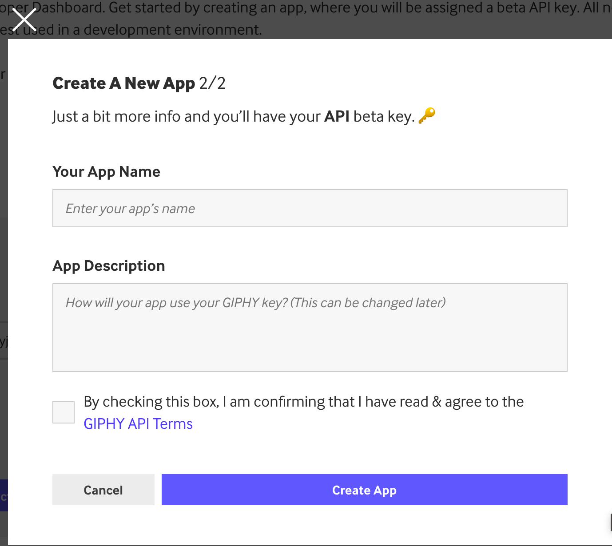

If you are using Strapi as your blogging platform like I do, probably you have spent time searching images from different image sharing platforms such as [Unsplash](https://unsplash.com/), [Pexels](https://www.pexels.com/) and [Giphy](https://giphy.com/) for your blog posts.

This could be a time-consuming process including preparing the proper attribution, downloading the images and uploading the images to your Strapi hosting.

That's why I created the plugin [strapi-plugin-zeasy-image-api](https://github.com/kwinyyyc/strapi-plugin-zeasy-image-api).

It aims to make the above processes a lot easier, it is suitable for any Strapi users that want to search for media and insert to their Rich Text field on Strapi.


### Get Started
In order to use the plugin, the easiest way is to use it along with the [strapi-plugin-wysiwsg-react-md-editor](https://github.com/kwinyyyc/strapi-plugin-wysiwsg-react-md-editor) plugin I created.

```bash
yarn add strapi-plugin-wysiwsg-react-md-editor
yarn add strapi-plugin-zeasy-image-api
```
What the zeasy image API plugin will do is to get the Rich Text editor component registered on your platform which is react-md-editor in this case and then it will re-register the Rich Text editor component with an image importing panel like below.


> Note: Strapi is registering your plugin fields in an alphabetical order, so if your Rich Text Editor plugin named anything before `strapi-plugin-"z"` the zeasy image API plugin would be able to re-register your component.


After that, you would have to create an account on Unsplash [here](https://unsplash.com/developers) and Giphy [here](https://developers.giphy.com/).

In the next step you have to create an app on each platform, the process is very simple.

#### Register an app on Unsplash
1. After logged in, click `Your apps` on the menu.
2. Click `New Application`.
3. Read and accept the terms.
4. Fill in the information below.

5. Scroll down and get your `Access Key`


#### Register an app on Giphy
1. After logged in, click `Create an app`
2. Click `Select API`

3. Fill in the information below and confirm the terms.

1. Get your API key


The last step is to update your `config\plugins.js` in your Strapi application and add below section.

```json
'zeasy-image-api': {
      providerOptions: {
        unsplash: {
          appName: env('UNSPLASH_APP_NAME'),
          accessKey: env('UNSPLASH_ACCESS_KEY'),
        },
        giphy: {
          accessKey: env('GIPHY_API_KEY'),
        },
      },
    }
```

That's it! Make sure you added environment variables `UNSPLASH_APP_NAME`, `UNSPLASH_ACCESS_KEY`, and `GIPHY_API_KEY` with the information you've got from the above steps.


Thanks for following along!


[](https://giphy.com/gifs/tv4-got-talent-talang-talangse-ygx6guQZ3kxF8A80bC)

----------

*This article [originally posted](https://blog.imkwinten.com/article/Import-images-and-gifs-to-your-Strapi-site?utm_source=medium&utm_medium=referral) on [my personal blog](https://blog.imkwinten.com/?utm_source=medium&utm_medium=referral) where I shared different topics including Node.js, Cloud computing, and other interesting stuff.*
