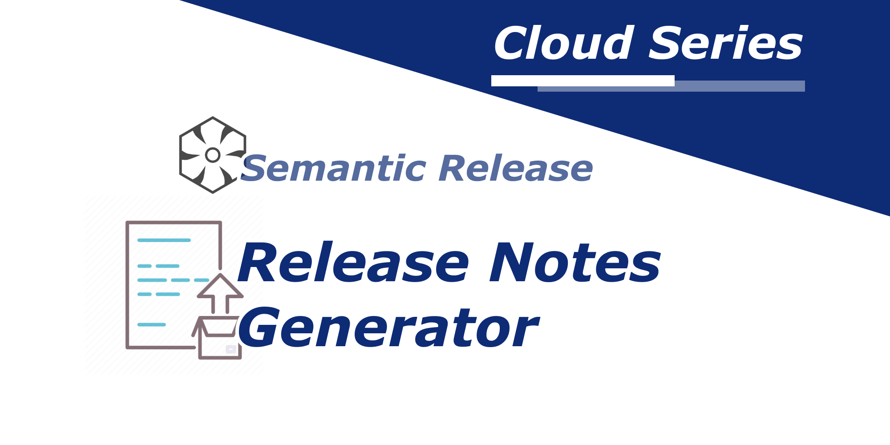

When trynig to generate release note with semantic-release, it is assuming you are using the angular commit message format. 

It expects your commit messages are using `#` as the issue prefix format and referencing the issue url `${YOUR_REPO_BASE_URL}/issues/${ISSUE_NUMBER_AFTER '#'}`

So as an example, if you have `Fix #12` in your commit message. Your release note would generate a link like this 


> Fix [#12](https://github.com/YOUR_REPO_NAME/issues/12).


In case you are using Azure Devops or Jira for issue tracking, you can customize the semantic release config as below:

### Steps
1.  Create a `.releaserc` in the project root directory
2. Put in below content

```json
{
  "plugins": [
    ["@semantic-release/commit-analyzer", {
      "preset": "conventionalcommits"
    }],
    ["@semantic-release/release-notes-generator", {
      "preset": "conventionalcommits",
      "presetConfig": {
        "issuePrefixes": ['AB#'],
        "issueUrlFormat": 'https://dev.azure.com/${REPLACE_WITH_ORGANIZATION_NAME}/${REPLACE_WITH_PROJECT_NAME}/_workitems/edit/{{id}}'
      }
    }],
    "@semantic-release/npm",
    "@semantic-release/github",
  ]
}
```

The above is an example for Azure Devops, in case you have different issue prefix and url, update the `issuePrefixes` and `issueUrlFormat` under `presetConfig`


### Important Note: be aware that it is a must to use `"preset": "conventionalcommits"` instead if `"preset": "angular"`, checkout the issue here
https://github.com/semantic-release/release-notes-generator/issues/184


Happy Automation!

 

[](https://giphy.com/gifs/Icommkt-marketing-automation-icomm-gEXumk4dWhEc2UriSX)

----------

*This article [originally posted](https://blog.imkwinten.com/article/Generate-release-notes-with-customized-issue-prefixes-and-url-format-when-using-Semantic-release?utm_source=medium&utm_medium=referral) on [my personal blog](https://blog.imkwinten.com/?utm_source=medium&utm_medium=referral) where I shared different topics including Node.js, Cloud computing, and other interesting stuff.*
